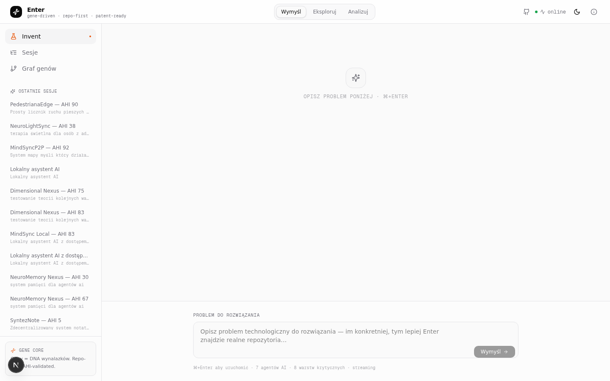
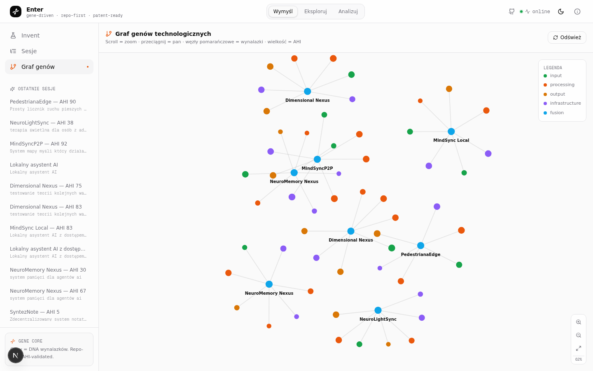
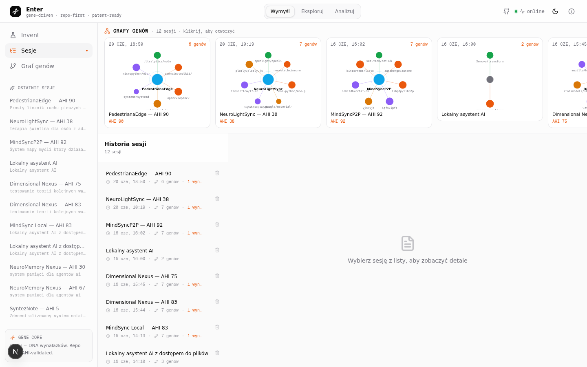
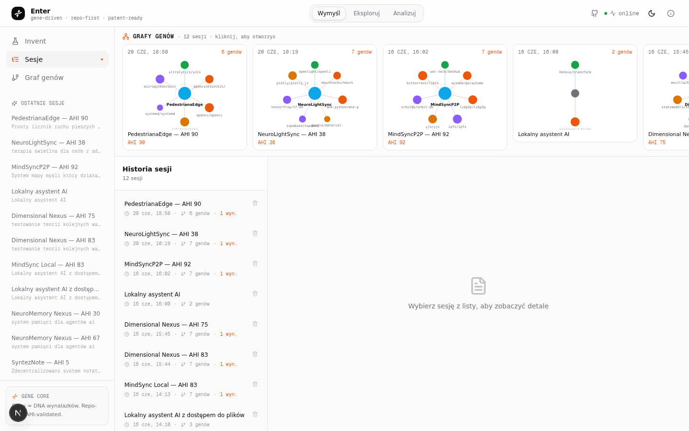

<p align="center">
  
</p>

<h1 align="center">GenLab</h1>

<p align="center">
  <strong>Gene-Driven Invention & Patent Pipeline</strong><br>
  AI-powered R&D lab that turns problem prompts into patentable inventions
</p>

<p align="center">
  
  
  
  
  
</p>

---


## What is GenLab?

GenLab is an **AI-powered research & development pipeline** that:

1. Takes a **problem prompt** (e.g. *"affordable water purification for rural areas"*)
2. Runs it through a **9-agent pipeline** that analyzes, extracts genes, filters by ethics, and fuses solutions
3. Outputs **patentable inventions** with claims, prior art, and novelty analysis
4. Generates **hardware BOMs** (Budget DIY / Performance / Pro Lab variants)
5. Stores everything in a **SQLite database** with full session history

Each "gene" is a **real GitHub repository** — GenLab finds open-source building blocks and combines them into novel inventions.

## Features

| Feature | Description |
|---------|-------------|
| **9-Agent Pipeline** | Problem Analyst → Gene Extractor → AHI Ethicist → Fusion Strategist → System Architect → Hardware Architect → Schematic Builder → Patent Composer |
| **AHI Scoring** | Autonomy / Ethics / Decentralization scores for every gene and invention |
| **Patent Framing** | Claim of novelty, prior art analysis, and IP defense for each invention |
| **Hardware BOMs** | 2–3 cost variants per invention (Budget DIY / Performance / Pro Lab) |
| **3D Gene Graph** | Interactive three.js visualization of gene relationships |
| **Session History** | Full audit trail of prompts, genes, inventions, and hardware |
| **Sandbox Mode** | Isolated experiments without affecting production data |
| **Dark/Light Theme** | Built-in theme switching with next-themes |
| **Multi-language** | i18n ready via next-intl |

## Screenshots

| Dashboard | Sessions | Invent | 3D Graph |
|-----------|----------|--------|----------|
|  |  |  |  |

| Session Detail | Inventions View |
|----------------|-----------------|
|  |  |

## Architecture

```
┌─────────────────────────────────────────────────┐
│                   Frontend                       │
│  Next.js 16 · React 19 · Tailwind 4 · shadcn   │
│  three.js (3D graph) · Recharts · Framer Motion │
├─────────────────────────────────────────────────┤
│                  API Routes                      │
│  POST /api/invent    — run 9-agent pipeline     │
│  GET  /api/sessions  — list sessions             │
│  GET  /api/genes     — gene database             │
├─────────────────────────────────────────────────┤
│              9-Agent Pipeline                    │
│  Problem Analyst → Gene Extractor → AHI Ethicist │
│  → Fusion Strategist → System Architect          │
│  → Hardware Architect → Patent Composer           │
├─────────────────────────────────────────────────┤
│                  Data Layer                       │
│  Prisma 6 · SQLite · z-ai-web-dev-sdk           │
└─────────────────────────────────────────────────┘
```

## Tech Stack

| Layer | Technology |
|-------|-----------|
| Framework | Next.js 16 (App Router, Turbopack) |
| UI | React 19, shadcn/ui, Radix UI, Tailwind 4 |
| 3D | three.js 0.184 |
| State | Zustand, TanStack Query |
| Forms | React Hook Form + Zod |
| Database | Prisma 6 + SQLite |
| AI | z-ai-web-dev-sdk |
| Animations | Framer Motion |
| Charts | Recharts |
| i18n | next-intl |
| Package manager | Bun |

## Quick Start

### Prerequisites

- **Bun** (recommended) or Node.js 18+
- **Git**

### Install

```bash
git clone https://github.com/limtzugar/GenLab.git
cd GenLab
bun install
bunx prisma generate
```

### Run

```bash
bun run dev
# → http://localhost:3000
```

### Environment

Copy `.env.example` to `.env` and configure:

```bash
cp .env.example .env
```

## Project Structure

```
GenLab/
├── src/
│   ├── app/
│   │   ├── api/              # REST endpoints
│   │   ├── lab/page.tsx      # Main dashboard
│   │   └── sandbox/          # Isolated experiments
│   ├── components/
│   │   ├── lab/              # Dashboard, sidebar, views
│   │   ├── sandbox/          # 3D gene graph, sandbox UI
│   │   └── ui/               # shadcn primitives
│   └── lib/
│       ├── agents.ts         # 9-agent pipeline
│       ├── zai.ts            # AI SDK singleton
│       ├── db.ts             # Prisma client
│       └── types.ts          # Shared types
├── prisma/schema.prisma      # Session, Gene, Invention, Hardware
├── scripts/                  # Bootstrap & utility scripts
├── public/                   # Static assets
└── db/                       # SQLite database
```

## Database Schema

| Model | Description |
|-------|-------------|
| **Session** | One pipeline run — prompt, mode, status, timestamps |
| **Gene** | A technology unit extracted from GitHub with AHI scores |
| **Invention** | Synthesized invention with patent framing |
| **Hardware** | BOM variants (Budget / Performance / Pro) |
| **Schematic** | Hardware schematic data |

## API Endpoints

| Method | Endpoint | Description |
|--------|----------|-------------|
| `POST` | `/api/invent` | Run the 9-agent invention pipeline |
| `GET` | `/api/sessions` | List all sessions |
| `GET` | `/api/genes` | Query genes from database |

## Development

```bash
# Dev server with hot reload
bun run dev

# Build for production
bun run build

# Start production server
bun run start

# Lint
bun run lint

# Database
bun run db:push      # Push schema changes
bun run db:generate  # Regenerate Prisma client
bun run db:migrate   # Create migration
bun run db:reset     # Reset database
```

## License

[MIT](LICENSE)
